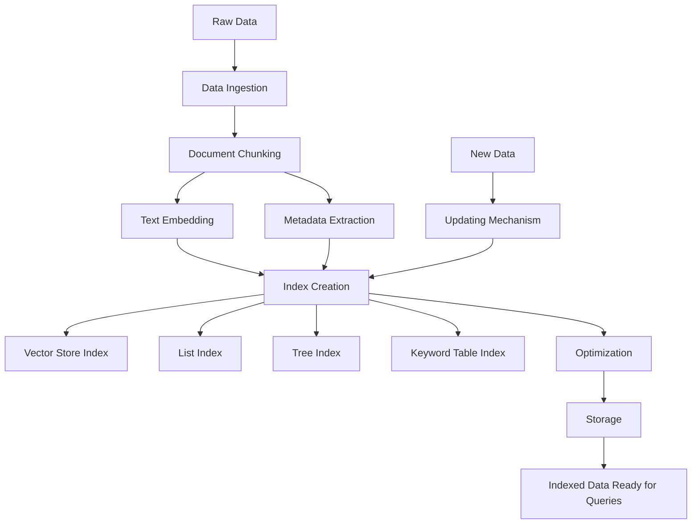

## Indexing Process

The indexing process is a crucial step that organizes and structures the ingested data for efficient retrieval and use with large language models. Here's a more detailed look at the indexing process:

- **Document Chunking:** 
   - Large documents are broken down into smaller, manageable chunks.
   - This helps in processing and retrieving information more efficiently.

- **Text Embedding:**
   - Each chunk of text is converted into a numerical vector representation (embedding).
   - These embeddings capture the semantic meaning of the text.

- **Index Creation:**
   - LlamaIndex offers various index structures, such as:
     - Vector Store Index: Uses vector embeddings for similarity search.
     - List Index: A simple sequential structure for smaller datasets.
     - Tree Index: Organizes data in a hierarchical structure.
     - Keyword Table Index: Creates a mapping between keywords and relevant text chunks.

- **Metadata Extraction:**
   - Additional information about each chunk (e.g., source, date, author) is extracted and stored.
   - This metadata can be used for filtering and improving search relevance.

- **Optimization:**
   - Indexes are optimized for quick retrieval, often using techniques like approximate nearest neighbor search for vector indexes.

- **Storage:**
   - The created index is stored, either in memory or persisted to disk, depending on the application's needs.

- **Updating Mechanism:**
   - LlamaIndex provides ways to update the index with new information, allowing for dynamic knowledge bases.

The indexing process aims to create a structure that allows for fast and relevant retrieval of information when queries are made, enabling the LLM to provide accurate and contextual responses based on the specific data ingested.